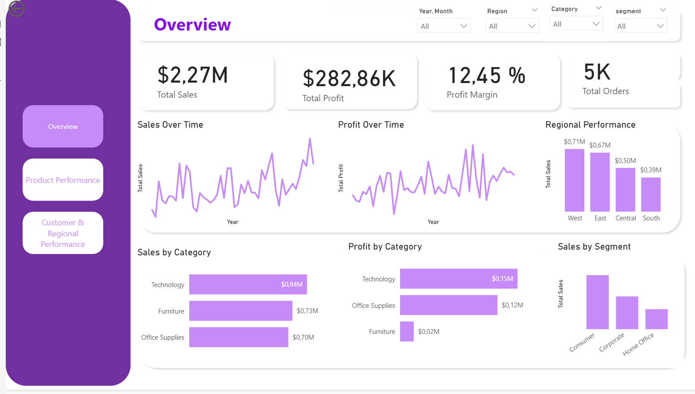
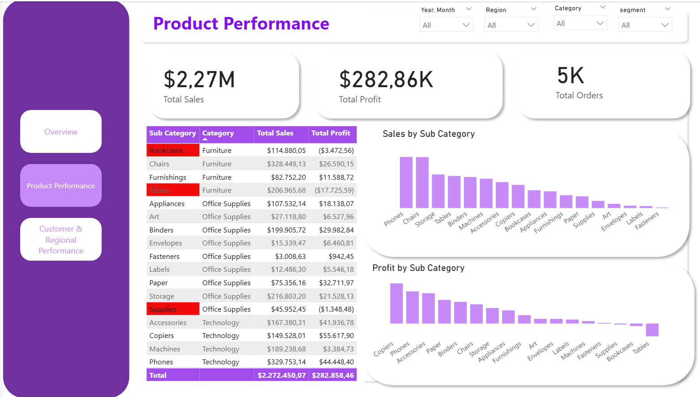
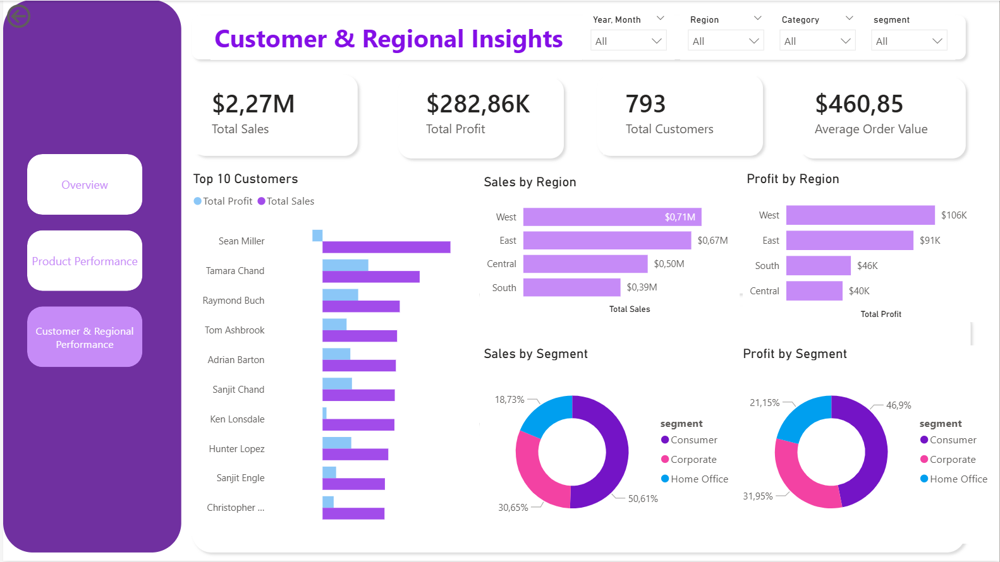

# Power BI Superstore Sales Analysis Dashboard 

## Project Overview

The goal of this project is to transform SQL-based sales analysis into an interactive Power BI dashboard.

After structuring and analyzing the dataset using SQL, the results are visualized in Power BI to provide a clear and interactive view of business performance.

The dashboard enables users to explore key business metrics such as sales, profit, customer value, product performance, and regional trends in order to support data-driven decision making.

---

## Tools & Technologies

- SQL Server / MySQL
- Power BI
- DAX (Data Analysis Expressions)
- Power Query
- MySQL Connector .Net
- Data Modeling
- Data Visualization

---

## Dataset

The dataset represents retail sales transactions including:

- Orders
- Customers
- Products
- Regions
- Sales
- Profit
- Discounts

Key variables include:

- Order Date
- Customer Segment
- Product Category
- Sub-Category
- Sales
- Profit
- Quantity
- Region
- State

---

## Dashboard Structure

The Power BI report is organized into three main analytical pages.

### 1. Overview

Provides a high-level summary of business performance.

Key metrics:

- Total Sales
- Total Profit
- Profit Margin
- Total Orders

Key insights:

- Sales and profit trends over time
- Regional sales performance
- Category contribution to revenue and profit
- Sales distribution by customer segment

---

### 2. Product Performance

Analyzes product-level profitability and category performance.

Key insights:

- Sales by Sub-Category
- Profit by Sub-Category
- Identification of high-performing product groups
- Identification of lower-performing product groups

This analysis helps understand which product categories contribute most to revenue and profitability.

---

### 3. Customer & Regional Performance

Focuses on customer value and geographic performance.

Key insights:

- Top 10 customers by sales
- Sales and profit by region
- Sales and profit distribution by customer segment
- Customer purchasing behavior

This page helps identify the most valuable customers and the strongest markets.

---

## Key Business Insights

Some key findings from the analysis include:

- Technology generates the highest overall revenue and profit margin.
- Profitability varies significantly across product categories.
- Sub Categories such as Tables and Bookcases show negative profitability.
- A small number of customers contribute a significant share of total sales.
- Regional performance differs across the United States, with some regions contributing more strongly to profit.

---

## Skills Demonstrated

This project demonstrates the following data analytics skills:

- Data extraction from SQL databases
- Data transformation using Power Query
- Data modeling in Power BI
- DAX measure creation
- Dashboard design and data storytelling
- Business performance analysis
- Interactive report development

---

## Dashboard Access and Preview

You can explore the dashboard in two ways:

1. Download the Power BI file  
 [Download the .pbix file](superstore_powerbi_dashboard.pbix)
- Note: To open the dashboard you need **Power BI Desktop** installed.
2. View the dashboard preview below

### Overview

### Product Performance

### Customer & Regional Performance

---

## Future Improvements

Possible extension of this project includes :

- Using **Python** (Pandas / Matplotlib) for advanced analysics

---

## Author
**Ariane Sime**
Business Informatics Student (**Wirtschaftsinformatik B.Sc.**)
Aspiring Data Analyst

