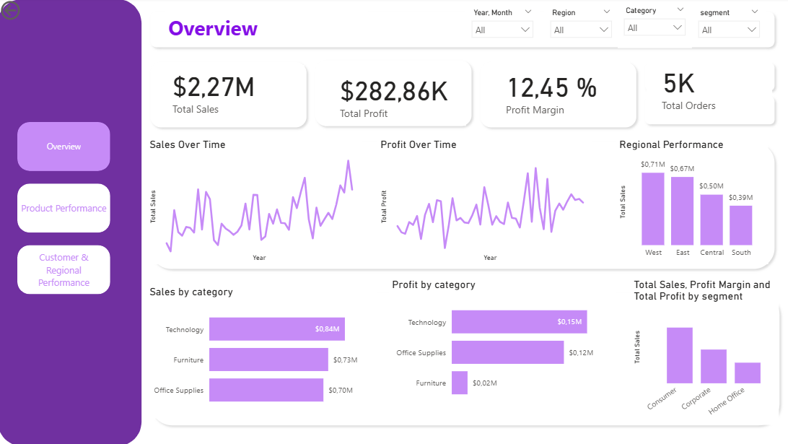
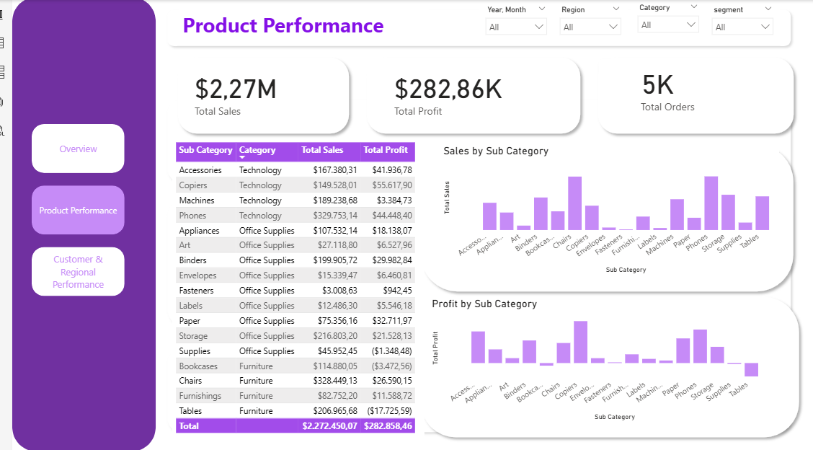

# Power BI Superstore Sales Analysis Dashboard 

## Project Overview

This project presents an end-to-end business analysis of retail sales data using **SQL Server and Power BI**.

The goal of the project is to transform raw transactional data into **actionable business insights** through data analysis and interactive dashboards.

The analysis focuses on identifying key drivers of sales, profit performance, customer value, and regional trends.

---

## Tools & Technologies

- SQL Server
- Power BI
- DAX (Data Analysis Expressions)
- Power Query
- Data Modeling
- Data Visualization

---

## Dataset

The dataset represents retail sales transactions including:

- Orders
- Customers
- Products
- Regions
- Sales
- Profit
- Discounts

Key variables include:

- Order Date
- Customer Segment
- Product Category
- Sub-Category
- Sales
- Profit
- Quantity
- Region
- State

---

## Dashboard Structure

The Power BI report is organized into three main analytical pages.

### 1. Overview

Provides a high-level summary of business performance.

Key metrics:

- Total Sales
- Total Profit
- Profit Margin
- Total Orders

Key insights:

- Sales and profit trends over time
- Regional sales performance
- Category contribution to revenue and profit
- Sales distribution by customer segment

---

### 2. Product Performance

Analyzes product-level profitability and category performance.

Key insights:

- Sales by Sub-Category
- Profit by Sub-Category
- Identification of high-performing product groups
- Identification of lower-performing product groups

This analysis helps understand which product categories contribute most to revenue and profitability.

---

### 3. Customer & Regional Performance

Focuses on customer value and geographic performance.

Key insights:

- Top 10 customers by sales
- Sales and profit by region
- Sales and profit distribution by customer segment
- Customer purchasing behavior

This page helps identify the most valuable customers and the strongest markets.

---

## Key Business Insights

Some key findings from the analysis include:

- Technology generates the highest overall revenue.
- Profitability varies significantly across product categories.
- A small number of customers contribute a significant share of total sales.
- Regional performance differs across the United States, with some regions contributing more strongly to profit.

---

## Skills Demonstrated

This project demonstrates the following data analytics skills:

- Data extraction from SQL databases
- Data transformation using Power Query
- Data modeling in Power BI
- DAX measure creation
- Dashboard design and data storytelling
- Business performance analysis
- Interactive report development

---

## Project Outcome

The final result is an interactive **Power BI dashboard** that allows users to explore business performance from multiple perspectives including product, customer, and regional analysis.

This type of analysis supports data-driven decision making in areas such as product strategy, customer targeting, and regional market development.

---

## Dashboard Preview

### Executive Overview

### Product Performance

### Customer & Regional Performance

